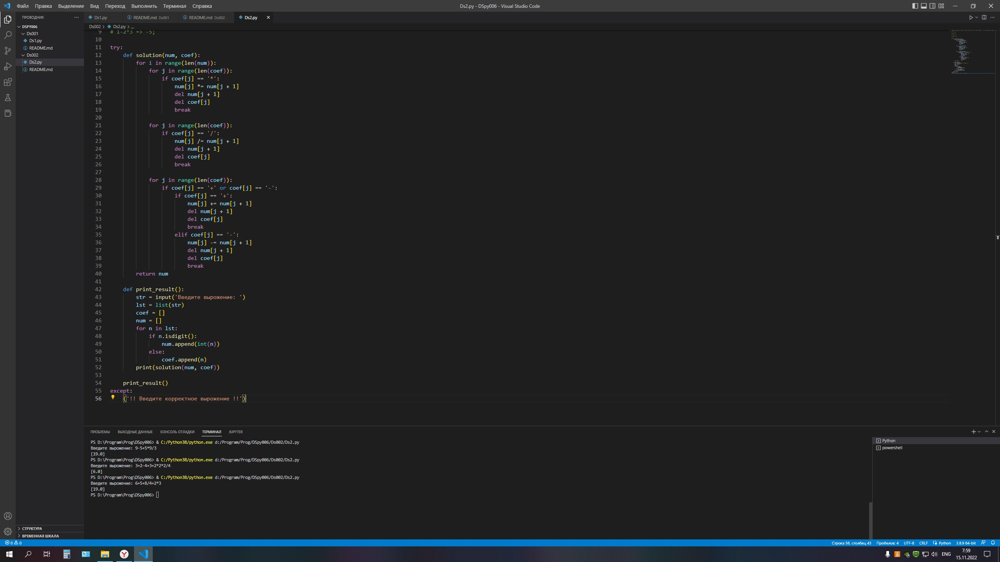

### Задача 2. Напишите программу вычисления арифметического выражения заданного строкой. Используйте операции +,-,/,*. приоритет операций стандартный.

### *Пример:* 
### 2+2 => 4; 
### 1+2*3 => 7; 
### 1-2*3 => -5;

